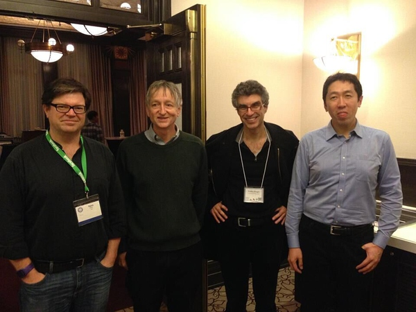
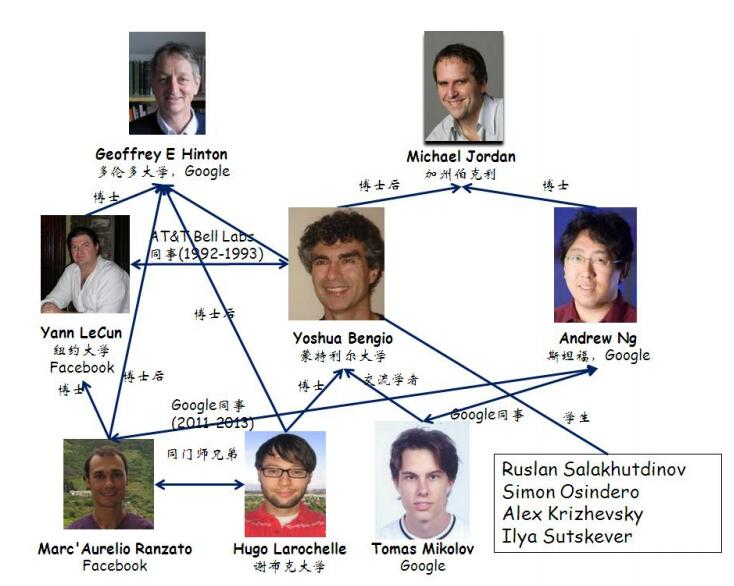

深度学习那么火，也忍不住跳坑了玩玩，一探究竟。玩深度学习，总会遇上那几个大牛的名字，例如深度学习四大天王：

- Geoffrey E. Hinton, Univ. of Toronto, Google
- Yann LeCun, NYU, Facebook, AT&T(pre) 
- Yoshua Bengio, Univ, of Montreal, AT&T(pre)
- Andrew Ng, Stanford Univ., Baidu, Google(pre)

这里附上一张深度学习圈子大牛的关系图谱，仅供八卦：

Hinton资历最老，LeCun师从Hinton，而Bengio和Ng都师从MJ。在神经语言模型领域，Bengio和Mikolov都有很卓越的贡献。

最近一直在做NLP，于是找了Deep Learning与**NLP**结合的一些经典paper，写个list作为research和学习路线。

1. Bengio, Yoshua, et al. "A neural probabilistic language model." The Journal of Machine Learning Research 3 (2003): 1137-1155.  神经网络语言模型(NNLM)的开山之作，Bengio 2003年提出了用神经网络来训练语言(生成)模型NNLM，为以后的RecurrentNN语言模型打好基础。**(NNLM)**

2. Morin, Frederic, and Yoshua Bengio. "Hierarchical probabilistic neural network language model." Proceedings of the international workshop on artificial intelligence and statistics. 2005.  Bengio提出的层次化概率神经网络语言模型，是对NNLM的扩展。**(NNLM)**

3. Collobert, J. Weston, L. Bottou, M. Karlen, K. Kavukcuglu, P. Kuksa. "Natural Language Processing(almost) from Scratch." Journal of Machine Learning Reserach(JMLR 2011)12:2493-2537.  2011 Collobert的这篇文章是NN+NLP的经典作品，后面list中的paper基本都会提及到这篇文章。基于深度神经网络自动学习词汇的向量表达，提出一个统一的多任务框架来处理NLP中的词性标注、浅层句法分析、命名实体识别和语义角色标注等任务，并发布基于这个框架的开源工具[SENNA](http://ml.nec-labs.com/senna/)。**(NNLM, Word Representation, Parsing, Entity Recognition, Semantic Role Labeling)**

4. Mikolov, Tomas, et al. "Recurrent neural network based language model." INTERSPEECH 2010, 11th Annual Conference of the International Speech Communication Association, Makuhari, Chiba, Japan, September 26-30, 2010. 2010.  循环神经网络RecurrentNN在语言模型的开山之作，NNLM经典模型——RNNLM，此后Mikolov多次靠RecurrentNN发paper，甚至包括他本人的PhD thesis。但是RecurrentNN最早却是Elman 1990提出的。目前RecurrentNN也是在语言模型中的state-of-the-art。注意：同样是NLP领域，Socher多次在句法分析Parsing使用的RNN是递归RecursiveNN，是基于结构上的递归网络，而循环RecurrentNN是基于时序上的递归网络。**(Recurrent-NNLM)**

5. Mikolov, Tomáš, et al. "Extensions of recurrent neural network language model." Acoustics, Speech and Signal Processing (ICASSP), 2011 IEEE International Conference on. IEEE, 2011.  Mikolov对2010年RecurrentNN在语言模型工作的扩展。**(Recurrent-NNLM)**

6. Kombrink, Stefan, et al. "Recurrent Neural Network Based Language Modeling in Meeting Recognition." INTERSPEECH. 2011.  Mikolov将RNNLM用于语音识别。**(Recurrent-NNLM, Speech Recognition)**

7. Mikolov, Tomáš. "Statistical language models based on neural networks." Presentation at Google, Mountain View, 2nd April (2012).  Mikolov在Brno Univ. of Tech.的PhD thesis，对RNN工作的一个整理。**(RecurrentNN overview)**

	8. Mikolov T.,Yih, and Zweig. "Linguistic regularities in continuous space word representation." In NAACK-HLT 2013, 746-751.  2013年Mikolov开始用神经网络在word representation上做工作了，之前的RecurrentNN只是用来生成文本的模型，现在关注使用embedding方法表示word。这篇paper也说明"pre-trained word embeddings可以提取有意义的语法和语义规则"。也为后来推出word2vec做了准备。**(注: 当时错误把word2vec归为RNN里，其实只是个shallow的神经网络即NNLM模型，属于特征学习，得到的pre-trained word vector可以用到RNN里)** **(<del>Recurrent NN,</del> Word Representation, Feature Learning)**

9. Socher, Huang, Pennington, Ng, and Manning. "Dynamic pooling and unfolding recursice autoencoders for paraphrase detection." In NIPS 2011, volume 24, 801-809.  来自Stanford的Socher最早在ICML 2011的文章"Parsing natural scenes and natural language with recursive neural networks"中用递归RecursiveNN对树形结构预测，进行句法分析。随后ACL 2013中，Socher又把RecursiveNN扩展为组合向量文法(Compositional Vector Grammar)，和概率上下文无关法(Probabilistic Context Free Grammar)结合来描述不同句法结构的信息。NIPS 2011中，Socher提出递归RecursiveNN构建sentence representation，用递归自动编码器解决句子长度不一致问题，在复述检测中取得不错效果。**(RecursiveNN Autoencoder, Parsing, Paraphrase Detection)**

10. Socher, Pennington, Huang, Ng, and Manning. "Semi-supervised recursive autoencoders for predicting sentiment distributions." In EMNLP 2011, 151-161.  在EMNLP 2011中，Socher在递归自动编码模型基础上，加入情感类别的监督信息，半监督的RecursiveNN在由词向量构建短语向量表示时，可以保留更多情感信息。**(RecursiveNN Autoencoder, Sentiment Analysis)**

11. Socher, B. Huval, C. D. Manning, and A. Y. Ng. "Semantic compositionality through recursive matrixvector
spaces." In EMNLP 2012.  在EMNLP 2012中，Socher团队又扩展了递归NN，提出Matrix-Vector Recursive NN模型来处理情感分析的语义合成。**(RecursiveNN, Sentiment Analysis, Semantic Compositionality)**

接下来的几篇比较新的paper将**重点关注**：

12. Socher, Perelygin, Wu, Chuang, Manning, Ng, and Potts. "Recursive deep models for semantic compostionality over a sentiment treebank." In EMNLP 2013, 1631-1642.  在EMNLP 2013中，折腾Recursive多年的Socher团队提出**递归神经张量网络Recursive Neural Tensor Network(RNTN)**，使用张量合成函数取代原来线性函数，扩展语义合成函数的能力范围。**(RecursiveNN, Sentiment Analysis, Semantic Compositionality)**

13. Mikolov, Tomas, et al. "Efficient estimation of word representations in vector space." In Proceedings of ICLR 2013.  Mikolov在ICLR 2013中的文章，在Bengio 2003年的模型上用RNN改进，去除网络隐含层，用两种模型CBOW和Skip-gram提升计算效率，发布了word2vec工具。**(RecurrentNN, Word Representation)**

14. Mikolov, Tomas, et al. "Distributed representations of words and phrases and their compositionality." Advances in Neural Information Processing Systems. 2013.  这是Mikolov对Skip-gram模型的扩展，用下采样(negative sampling)的方法取代hierachical softmax的方法，加速训练，优化词特征表示。NIPS 2013经典paper。**(RecurrentNN, Word Representation)**

	15. Le, Quoc V., and Tomas Mikolov. "Distributed representations of sentences and documents." In Proceedings of ICML 2014.  Mikolov继发布word2vec后又发布paragraph2vec，将词向量表示方法扩展到文档向量表示，但这篇论文的实验结果被ICLR 2015论文"Ensemble of Generative and Discriminative Techniques for Sentiment Analysis of Movie Reviews."(Mesnil, Mikolov, Bengio, [代码下载](https://github.com/mesnilgr/iclr15))质疑。**(<del>RecurrentNN,</del> Text Represeantation)**

16. Kalchbrenner, and Blunsom. "Recurrent convolutional neural networks for discourse compositionality." In Workshop on CVSV 2013, 119-126.  2013年，Kalchbrenner使用了recurrent+cnn的方法用在discourse compositionality上。**(Recurrent+CNN)**

17. Kalchbrenner, Nal, Edward Grefenstette, and Phil Blunsom. "A convolutional neural network for modelling sentences." In Proceedings of ACL 2014.  2014年，alchbrenner提出动态CNN(Dynamic CNN)模型对句子进行语义建模，在情感分类上取得不错效果。**(CNN, Sentence Representation, Sentiment Analysis)**

18. Shen, He, Gao, Deng, and Mesnil. "Learning Semantic Representations Using Convolutional Neural Networks for Web Search." In Proceedings of WWW 2014.  微软研究院Redmond总部团队用CNN学习Web检索查询的语义表达问题，2页短paper发表在WWW 2014。**(CNN, Semantic Learning)**

19. Kim, Yoon. "Convolutional neural networks for sentence classification." In Proceedings of EMNLP 2014.  将CNN用于句子分类，[代码下载](https://github.com/yoonkim/CNN_sentence)。**(CNN, Sentence Representation, Classification)**

20. Lai, Siwei, et al. "Recurrent convolutional neural networks for text classification." Twenty-Ninth AAAI Conference on Artificial Intelligence. 2015.  中科院自动化所发表在AAAI 2015的论文，将循环CNN(RecurrentCNN)用于训练文本representation及文本分类。**(Recurrent+CNN, Text Classification)**

由于很少涉猎深度学习与图像语音等领域，故没有去了解太多图像和语音相关的paper。以下附一些关于**深度学习的经典paper的list**：

21. LeCun, Yann, et al. "Gradient-based learning applied to document recognition." Proceedings of the IEEE 86.11 (1998): 2278-2324. 卷 积神经网络CNN的开山之作。**(CNN)**

22. Hinton, Geoffrey E., Simon Osindero, and Yee-Whye Teh. "A fast learning algorithm for deep belief nets." Neural computation 18.7 (2006): 1527-1554.  深度学习的开山之作，Hinton用限制波尔兹曼机(RBM)堆叠成深度信念网络DBN，在MNIST数据集表现比Neural Network好。正是Hinton这篇论文让神经网络重新火起来。**(DBN, RBM)**

23. Hinton, Geoffrey E., and Ruslan R. Salakhutdinov. "Reducing the dimensionality of data with neural networks." Science 313.5786 (2006): 504-507.  Hinton用神经网络对数据进行降维，对比了PCA方法，论文发表在Science上。**(DNN, Dimension Reduction)**

24. Bengio, Yoshua, et al. "Greedy layer-wise training of deep networks." Advances in neural information processing systems 19 (2007): 153.  Bengio对Hinton 2006年工作的补充。**(DNN)**

25. Bengio, Yoshua. "Learning deep architectures for AI." Foundations and trends® in Machine Learning 2.1 (2009): 1-127.  Bengio写的深度学习综述，入门必读。**(DNN)**

26. LeCun, Bengio, Hinton. "Review: Deep learning." Nature 521 (2015):436-444.  三神2015年5月28日联合发表在Nature上的综述论文。**(Deep Learning)**

