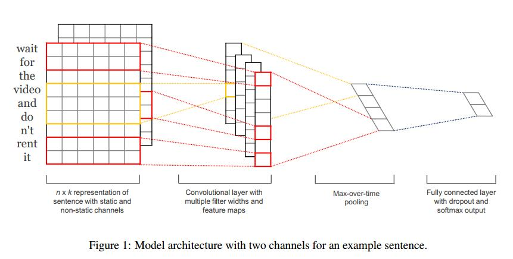
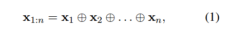
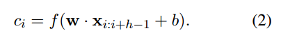
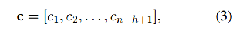
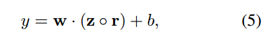
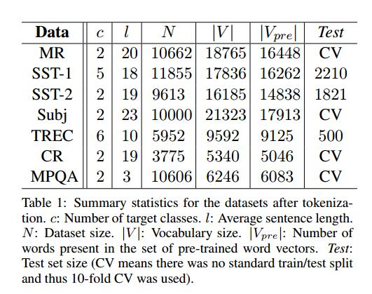
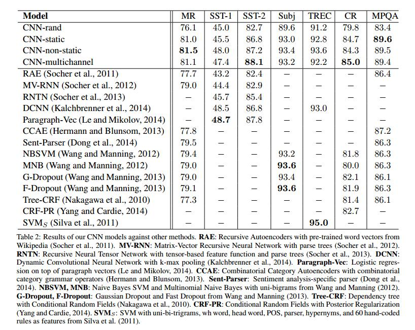

这是NYU的Yoon Kim发表在EMNLP 2014的paper，将DNN中的CNN用于NLP领域的句子分类中。EMNLP全称Conference on Empirical Methods in Natural Language Processing，在NLP领域是仅次于国际计算语言学协会ACL(Annual Meeting of the Association for Computational Linguistics)的会议，录取率在20%。

- 论文：[http://arxiv.org/abs/1408.5882](http://arxiv.org/abs/1408.5882)
- 代码：[https://github.com/yoonkim/CNN_sentence](https://github.com/yoonkim/CNN_sentence)

----

## 1. Background

深度学习在NLP领域中的工作，更多集中在通过神经网络来学习词向量的representations（如Bengio 2003、Yih 2011和Mikolov 2013年的工作）和用学习得到的词向量进行分类（Collobert 2011年的工作）。通过一个hidden layer实现了词向量从1-of-V编码的稀疏表示转换到低维度的向量空间，作为一个必不可少的特征提取器，实现语义特征的编码表示。在词向量这种稠密表示中，相似的词的欧式距离或者余弦距离很近。

在LeCun 1998的工作中，CNN使用带有卷积过滤器的layes，应用在local feature提取。目前CNN已被证明在NLP领域中达到很好的效果，如semantic sparsing（Yih 2014）、search query retrieval（Shen 2014）、sentence modeling（Kalchbrenner
 2014）和其他NLP任务中（Collobert 2011）。

目前的工作：

- 通过无监督的神经语言模型（NLM）得到词向量，即通过Mikolov 2013的word2vec训练Google新闻中的1000亿个单词得到。
- 在词向量之上训练一个简单的1层卷积层的CNN模型。
- 最初保持词向量不变（static），只学习模型的其他参数。
- 需要稍微的超参数tuning就可以在不同的benchmark上获得很好的结果，这表明**由特征提取器得到的pre-trained向量是universal的，可以用在不同的分类任务上**。
- 对于特定的任务，通过fine-tuning学习到的向量可以达到更好提升效果。
- 工作最后描述了对架构的简单修改，通过拥有多个channels让模型允许同时使用pre-trained和特定任务的vectors。

----

## 2. Research Methods

对于上图的模型，一个句子"wait for the video and don't rent it"可以用8个6维词向量表示(n=8, k=6)。架构采用两个channel（第一层）来表示同一个句子，一个channel是static，另一个是non-static（即加上fine-tuning）。在一个channel内，采用不同的h即不同的filter，可以得到多个卷积层（即第二层）——如图采用了4种h，h=2和h=3表示两种filter，每个词向量经过卷积filter和激活函数得到一列特征值，经过h=2和h=3两种filter映射到两列特征值。因此卷积层有4列特征值，经过Max-over-time pooling，取各自特征值向量的最大值，得到倒数第二层的4个特征值。通过最后一层全相联层的dropout正则化和softmax输出label的分布概率。

### 2.1 n*k representation of sentence

用一个k维向量Xi来表示一个句子中的第i个单词，一个句子就可以表示成n个词向量的连结：

### 2.2 Convolution

卷积操作用来产生新的特征，大小为h*k的滤波器w和h个单词长度的window进行卷积，h个单词组成的单词串Xi:i+h-1（即单词窗）卷积后经过激活函数f（非线性函数如双曲正弦函数）输出，得到特征Ci：

因此n-h+1个单词窗组成的一个句子{X1:h, X2:h+1, ..., Xn-h+1:n}，可以得到一个长度为n-h+1的特征映射：

### 2.3 Pooling

对C向量进行max-over-time的pooling操作，取向量内的最大值作为最重要的特征值，即C_hat = max{C_bar}。这种pooling的原理可以很自然应付不同长度的句子。

### 2.4 Softmax Output

对于一个特定的h得到的filter，可以得到一个特征(值)。改变不同的h，得到多个filters可以得到多个特征(值)，组成倒数第二个layer。通过全相联的Softmax layer，输出labels的概率分布。

### 2.5 Regularization正则化

为了正则化，对倒数第二层采用dropout，即用权重向量的l2范数作为约束项constraint（Hinton 2012的工作）。Dropout可以通过随机dropping out防止hidden units的co-adaptation。

对于m个filters（h取m种不同的值）得到大小为1*m的向量Z=[C1_hat, ..., Cm_hat]，dropout使用：

----

## 3. Experiemnt

### 3.1 Datasets的介绍：

- **MR**：单个句长的Movie Review，类别为2——postive和negative。[Download](https://www.cs.cornell.edu/people/pabo/movie-review-data/)
- **SST-1**：Stanford Sentiment Treebank，MR的扩展，但分割好train/dev/test三类数据集，同时类别的粒度更细，包括very postive/postive/neutral/nagative/very negative共5类)。[Download](http://nlp.stanford.edu/sentiment/)
- **SST-2**：SST-1去掉中立观点，然后label二值化。
- **Subj**：Subjectivity数据集，用于句子分类（主观/客观）。
- **TREC**：TREC问题数据集，问题句子分类（人/位置/数字信息6类）。[Download](http://cogcomp.cs.illinois.edu/Data/QA/QC/)
- **CR**：Customer Review关于不同产品，postive/negative两类。[Download](http://www.cs.uic.edu/~liub/FBS/sentiment-analysis.html)
- **MPQA**：Opinion Poplarity检测。[Download](http://www.cs.pitt.edu/mpqa/)

### 3.2 Hyperparameters & Training

超参数值通过在SST-2的dev集上grid search获得以下参数，并对所有数据集使用。对于没有dev集的数据集，随机选择测试集的10%作为dev集。

- **filter windows(h)**:3, 4, 5
- 每一个h的**feature maps**: 100
- **dropout rate(p)**: 0.5
- **constraints(s)**: 3
- **mini-batch size**: 50

Training通过再shuffled mini-batches上的随机梯度下降完成。

### 3.3 Pre-trained Word Vectors

word2vec从1000亿个Google News上的单词得到公开的词向量（300维），使用连续词袋CBOW（Continuous Bag of Words）训练。对于pre-trained词集中没有出现的单词，随机初始化其词向量。

### 3.4 Model Variations

使用四种不同的模型进行实验：

- **CNN-rand**: 所有的单词词向量都随机初始化，通过训练来修改。作为baseline模型。
- **CNN-static**: 使用word2vec得到的pre-trained向量，所有的词向量保持不变（static），只学习模型的其他参数。
- **CNN-non-static**: 和CNN-static类似，但对于每个task，pre-trained向量都经过fine-tuned。
- **CNN-multichannel**: 有两个词向量集合（但都从word2vec得到）的模型，即使用两个channel，每个channel使用相同的filter，但gradient只通过其中一个channel反向传播（back-propagated）。因此模型可以实现一个channel保持static，另一个channel为fine-tuning。

----

## 4. Results

CNN-rand作为baseline，效果当然不好。但简单模型CNN-static已经取得很好的结果，可以和别的随机深度学习模型(如2014的DCNN和2013的RNTN)相比。对每个task都对pre-trained的vectors进行fine-tuning，可以获得更多改善。**结论：**pre-trained的vector很好，universal的特征提取可以用在不同的数据集。

## Conclusion & Future Work

> Despite little tuning of hyperparameters, a simple CNN with one layer of convolution performs remarkably well.

> Un-supervised pre-training of word vectors is an important ingredient in deep learning for NLP.
