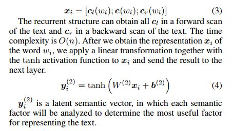

中科院自动化所的模式识别国重实验室（NLPR）发表在AAAI 2015的文章，用改进的CNN模型进行文本分类任务。第29届AAAI（The Association for the Advancement of Artificial Intelligence，美国人工智能协会）人工智能会议于2015年1月在Austin举行，也是第一次在冬季举行。

- 论文：[http://www.aaai.org/ocs/index.php/AAAI/AAAI15/paper/view/9745/9552](http://www.aaai.org/ocs/index.php/AAAI/AAAI15/paper/view/9745/9552)

----

## 1. Background

作为NLP领域的常见任务，文本分类广泛用在Web检索、信息过滤、情感分析（Sentiment Analysis）等场景。

### 1.1 Feature Representation

文本分类的关键问题是特征表示（feature representation）：

- 最常见的是**词袋模型BoW**，包括unigrams、bigrams、n-grams或其他一些pattern作为文本的特征表示
- 后来更多使用frequency、MI(Mutual Information?)、pLSA、LDA等特征提取方法筛选更discriminative的特征

上述特征提取方法的**问题**在于，**忽略文本的上下文信息或者文本中的词序，难以提取词的语义**。如bank既有"银行"也有"河岸"的意思，单纯的unigram模型难以区分，只有在更高阶的grams（或者tree kernals）才能有效区分，但这仍然有数据稀疏（data sparsity）的问题，影响分类的accuracy。

### 1.2 Deep Neural Network

为了解决数据稀疏的问题，2003年Bengio的神经网络语言模型（NNLM）提出Word Representation Learning的方法，即用神经网络实现单词的Distributed Representation——**Word Embedding**（Hinton更早就提出将单词映射到另一个向量空间进行表示）。随后2013年Mikolov、Yih和Zweig证明pre-trained的word embedding可以提取有意义的语法和语义规则。

#### 1.2.1 Recursive Neural Networks

2011年起Socher提出了**RecursiveNN(递归神经网络)**，用来构建句子的representations，但有以下**问题**：

- RecursiveNN通过树结构来构建representation，性能依赖于textual tree construction的性能。
- 构建textual tree的时间复杂度为O(n^2)，n是text的长度。当模型遇到较长的句子或文档，将非常耗时。
- 两个句子间的关系很难通过树结构来表达。

因此RecursiveNN不适合用于对长句子或文档的建模。 

#### 1.2.2 Recurrent Neural Networks

另一个representation model是**RecurrentNN(循环神经网络)**，Elman 1990年用RecurrentNN模型word by word分析text，然后在一个固定的隐含层中保存previous text的语义信息。Mikolov 2010年的论文[Recurrent neural network based language model]()也引入RecurrentNN训练语言模型。**优点**是Recurrent可以提取语义信息，适用于于长文本。**缺点**是RecurrentNN是个偏倚(biased)模型，later的单词会比earlier的单词重要，这会降低从全文提取语义的有效性（因为关键信息分布在全文任何位置而不是都在结尾）。

#### 1.2.3 Convolutional Neural Networks

为了解决偏倚问题，无偏倚模型CovolutionalNN通过一个"最大池化"max-pooling层，来判决文本中的discriminative phrases。因此CNN可以比上述两种RNN能更好提取文本的语义。CNN的时间复杂度也只是O(n)。但有**问题**：之前的CNN研究倾向于用简单的卷积核如"固定窗"，但窗的size难以选择，小的size会导致重要信息的缺失，大的size会产生一个巨大的参数空间（难以训练）。

因此，能不能比传统的window-based神经网络学到更多的上下文信息(contextual infomation)，可以更精准地表达文本的语义，用来进行文本分类？

----

## 2. Research Methods

为了解决上述模型的缺陷，这篇paper提出了**Recurrent Convolutional Neural Network(RCNN)**：

- 应用双向循环(bi-directional recurrent)的结构，与传统window-based神经网络相比引入更少的噪声，在学习word representations时最大程度地提取上下文信息。
- 在学习text representations时，模型可以保存更大的词序(word-ordering)的范围。
- 使用max-pooling层，可以自动判断特征对于文本分类是否重要，提取文本的关键部分(key component)。
- 联合recurrent结构和max-pooling层，RCNN模型可以同时获得RecurrentNN和CNN的优势。
- RCNN模型的时间复杂度为O(n)，与文本的长度呈线性相关。

整个RCNN模型包括三层，recurrent结构的卷积层、max-pooling层和输出层。网络模型的输入为文档D（词序列组成），输出时计算选取最大的p(k|D,theta)作为D所属的类别k。

- 第一层卷积层用来训练输入文档，学习得到文档每个词的**Word Representation**。
- 第二层max-pooling对卷积层输出的所有词的representations进行池化，提取全文的信息作为**Text Representation**。
- 第三层用softmax函数计算概率。

### 2.1 Word Representation Learning

正如上文所说，为了保留上下文信息，模型的word用embedding向量和context向量组合表示。因此，卷积层是一个双向的循环结构，可以看成文本中按顺序的n个单词平面(行)组成，行与行之间通过单词的上文和下文关系连接。

如**公式(3)**所示，每一行为文本中单词wi的representation，即xi，包括三部分，wi的left-context向量cl(wi)，wi的embedding向量e(wi)及其right-context的向量cr(wi)。

当前wi的上、下文信息的向量分别通过**公式(1)、(2)**计算，如wi的left-context由前一个单词w(i-1)的left-context cl(w(i-1))和前一个单词的embedding向量e(w(i-1))经过各自的矩阵转换W(l)和W(sl)后求和再进过一个非线性激活函数f得到。同理right-context也可以通过下一个单词经W(r)和W(sr)计算得到。矩阵转换就是图中的单词行与行之间的连接，实现从上一隐含层到下一隐含层的转换。cl(wi)和cr(wi)都是大小为\|c\|的dense vector，e(wi)是大小为\|e\|的dense vector。任何文档的第一个单词的cl向量都使用同一个共享的cl(w1)，最后一个单词都使用共享的cr(wn)（注：对于不同的文档，长度n不同）

整个循环结构通过forward scan和backward scan获得整个text所有的cl和cr，时间复杂度O(n)。从而获得所有单词wi的表达xi。如**公式(4)**所示，对每一单词行得到的xi先进行线性变换，再输入激活函数-双曲正切函数tanh得到结果yi(2)即每一单词的latent semantic vector(可以用来分析对于表示text的重要程度)，传到下一层max-pooling。

### 2.2 Text Representation Learning

卷积层得到一篇文档所有单词的隐语义向量，通过第二层的max-pooling获得该文本的representation。如**公式(5)**所示，max函数是element-wise的，即对变量内的逐一元素运算。对于一篇文档所有单词的yi(2)，即向量y1(2)、y2(2)...、yn(2)，max函数是取所有的yi(2)向量内各个位置的最大值得到y(3)，即y(3)向量的第k个元素是所有yi(2)第k个元素的最大值：

这样对于不同长度n的文档，经过max-pooling后都可以转化为固定长度大小的y(3)向量（注：大小与yi(2)相同，即和每一个单词经过激活函数输出的向量大小相同），这个向量就是提取全文信息的text representation。pooling时间复杂度为O(n)。

（paper也提及到别的pooling layer方法如Collobert 2011用到的average pooling layer，但一篇文档中只有部分单词以及它们的组合可以表示文档的含义，max-pooling就是寻找最重要的隐语义向量yi(2)）

输出层与传统神经网络相似，按照**公式(6)**定义，对池化输出y(3)进行线性变换得到y(4)。如**公式(7)**所示，对y(4)使用softmax函数求取概率。

### 2.3 Training

上述涉及的网络参数通过训练training set得到，用theta表示要训练的参数：

这是个supervised的训练过程，以文本所属class为参照，训练目标为调整theta，使得log似然函数最大化：

使用Bottou 1991提出的随机梯度下降(SGD)算法，随机选择样本(D, classD)来计算target函数的梯度来更新参数：

----

## 3. Experiment

### 3.1 Datasets

4个数据集均被分割成训练集和测试集：

- **ACL & SST**有预定义好的training、development和testing集
- **20Newsgroups & Fudan set**：划10%的training给development

### 3.2 Experiment Settings

#### 3.2.1 Preprocess

- English documents: 使用[Stanford Tokenizer](http://nlp.stanford.edu/software/tokenizer.html)获取token
- Chinese documents：使用[ICTCLAS](http://ictclas.nlpir.org/)进行分词
- 没有移除任何停止词和符号

#### 3.2.2 Evaluation Metric

- **20Newsgroups**使用**Macro-F1**值（根据state-of-the-art的工作）
- 其他数据集使用**Accuracy**作为metric

### 3.3 Hyper-parameter

- 超参数的设置依赖具体数据集，使用前人工作(Collobert 2011, Bengio 2010)中常用的一组参数
- 随机梯度下降的学习率 alpha = 0.01
- 隐含层数 H = 100
- word embedding向量大小 \|e\| = 50 
- context向量大小 \|c\| = 50
- word embedding训练参数使用word2vec(Skip-gram)的默认参数
- 使用中英文的Wikipedia dumps来训练word embedding

### 3.4 Comparison of Methods(Baseline or Reference)

----

## 4. Result

