Published on journal *Neurocomputing* (2012), Elsevier.

- [Paper download](http://www.sciencedirect.com/science/article/pii/S0925231211003985)

---

## 1. Background

- Tagging system allows users to annotate resources with keywords, make it convenient for information organization. 
- To support users in choosing the right keywords, recommendation algorithm should take both **content** & **user's preferences**
- Introduce an approach for personalized tag recommendation, a probabilistic model of (tags from resources + tags from user)
- Investigate simple **language model(LM)** & **Latent Dirichlet Allocation(LDA)**
- Experiments on *Delicious* & *Bibsonomy* dataset

---

## 2. Research Method

LDA has gained attention for tag recommendation, basically using for eliciting topics from words in documents. On the other hand, LDA can infer topics from the **available tags of resources** and then recommend **additional tags** from these latent topics. The traditional LDA recommend tags using content of resources only. (In other words, **without personalization**)

### 2.1 Goals

This paper extend LDA model with users' personal tagging practices, combining LDA with language model, from both resource & user perspective(resource-centered & user-centered). **Task:** given a resource *r* & a user *u*, algorithm caculates the probability of a tag *t*, ranks possible tags and recommend the tags with high scores.

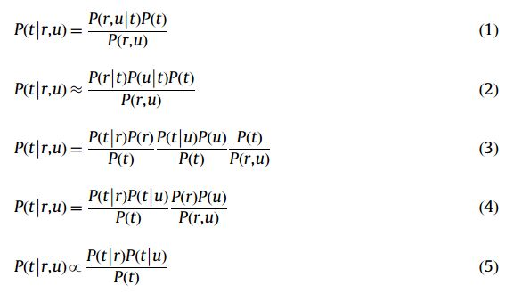

- Eq.(1) applies Bayes' rule 
- Eq.(2) assumes conditional independence of *r* & *u* given *t*
- Eq.(3) applies Bayes' rule repectively
- Eq.(4) simplifies Eq.(3)
- Eq.(5) discards factors *P(r)*, *P(u)* & *P(r,u)* (equal for all tags)

### 2.2 Approach

- *P(t)*: estimate frequency of tag *t*
- *P(t\|r)*, *P(t\|u)*: using **LM+LDA**

**Attention:** Typically tags for paticular user are more than for a resource, hence *P(t\|u)* should be weighted more strongly than *P(t\|r)*. Smoothen these two part with prior probability *P(t)*:

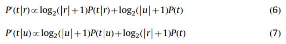

### 2.3 Language Model

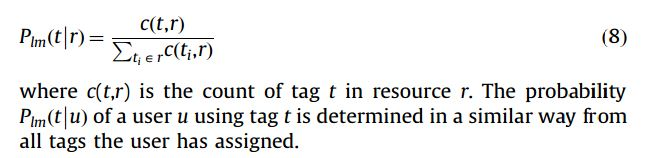

### 2.4 LDA Model

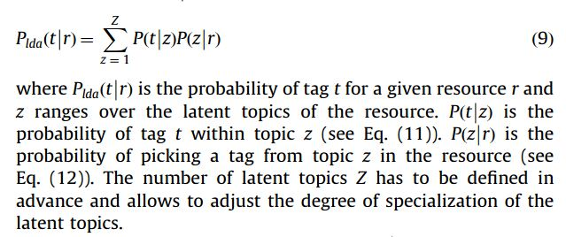

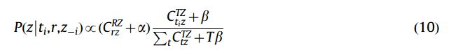

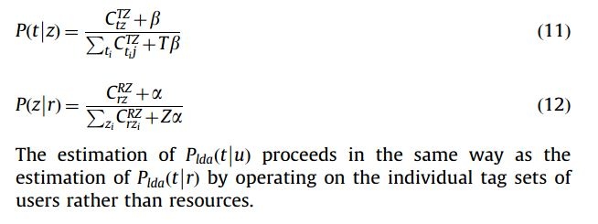

### 2.5 Combining LDA & LM

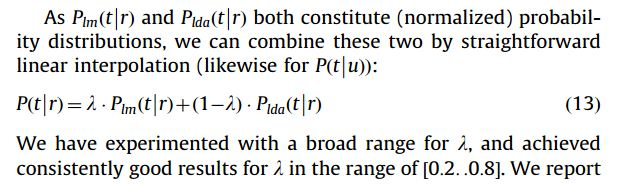

---

## 3. Evaluation

### 3.1 Dataset

- *Delicious*: [http://delicious.com/](http://delicious.com)
- *Bibsonomy*: [http://www.bibsonomy.org/](http://www.bibsonomy.org)

### 3.2 Evaluation Metrics

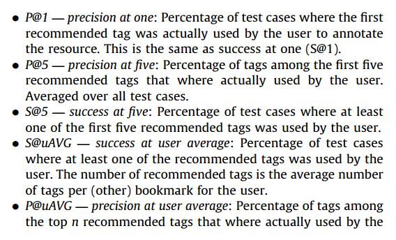

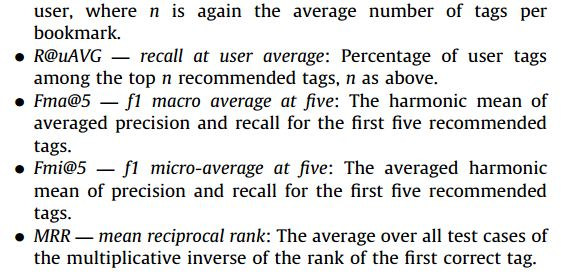

## 4. Result

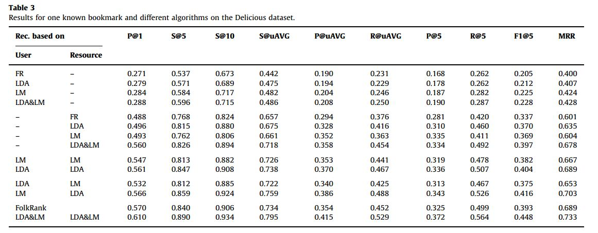

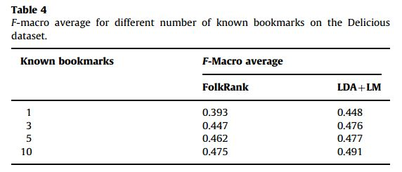

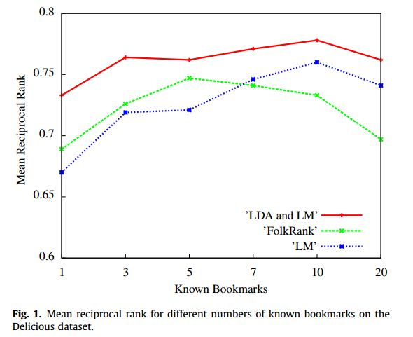

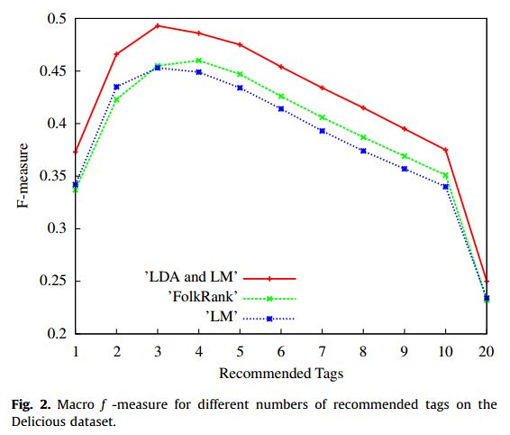

